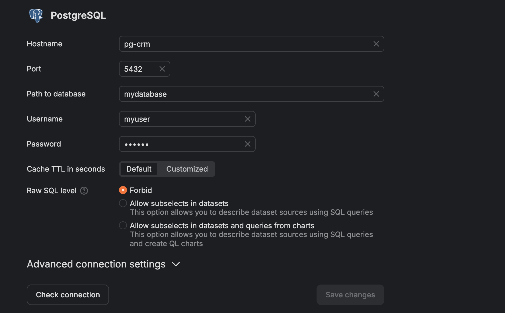

docker build -t postgres-with-data .
docker run -d -p 5432:5432 postgres-with-data
psql -h localhost -p 5432 -U myuser -d mydatabase
password = mypassword

cd datalens
docker compose up -d
создаем connection

constraint-ы и дефолты обрабатываются успешно. в таблице youtube_video есть поле duration, которое объявлено так:

duration INT CHECK (duration >= 0) DEFAULT NULL

1. в это поле можно ничего не писать, тогда значение будет NULL
2. можно явно записать NULL
3. если записать числовое значение, то тогда оно будет проверяться через CHECK-CONSTRAINT (>= 0). запись -1, к примеру выдаст подобную ошибку
   ERROR: new row for relation "youtube_video" violates check constraint "youtube_video_duration_check"
